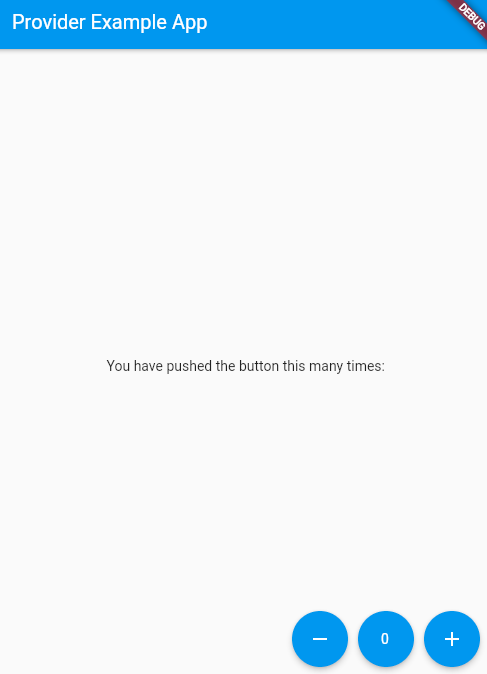

# betterapp

See:
* [Flutter Provider Tutorial (State Management)](https://www.youtube.com/watch?v=L_QMsE2v6dw) by Benjamin Carlson on YouTube
  * (describes best practice state management with providers)

Contents:
- [betterapp](#betterapp)
  - [Counter Provider](#counter-provider)
    - [01. Install provider package](#01-install-provider-package)
    - [02. Write an app](#02-write-an-app)
    - [03. Create a provider](#03-create-a-provider)
    - [04. Add the provider to the app](#04-add-the-provider-to-the-app)
    - [05. Access the provider](#05-access-the-provider)
    - [06. Optimization](#06-optimization)

## Counter Provider

### 01. Install provider package

Add provider to `pubspec.yaml` and do `flutter get pub`

Or simply use the pubspec assist VS Code extension. (`ctrl+P`, `Pubspec Assist: Add/update dependencies`)

### 02. Write an app

We will create a counter app with increment/decrement/reset buttons.



In `lib/main.dart`:
```dart
import 'package:betterapp/screens/home_screen.dart';
import 'package:flutter/material.dart';

void main() {
  runApp(MyApp());
}

class MyApp extends StatelessWidget {
  @override
  Widget build(BuildContext context) {
    return MaterialApp(
      initialRoute: '/',
      routes: {'/': (context) => MyHomePage()},
    );
  }
}
```

In `lib/screens/home_screen.dart`:
```dart
import 'package:flutter/material.dart';

class MyHomePage extends StatelessWidget {
  const MyHomePage({Key? key}) : super(key: key);

  @override
  Widget build(BuildContext context) {
    return Scaffold(
      /* App Bar */
      appBar: AppBar(
        title: Text('Provider Example App'),
      ),

      /* Body */
      body: Center(
        child: Column(
          mainAxisAlignment: MainAxisAlignment.center,
          mainAxisSize: MainAxisSize.min,
          children: <Widget>[
            Text('You have pushed the button this many times:'),
          ],
        ),
      ),

      /* Floating Action Button */
      floatingActionButton: Row(
        mainAxisAlignment: MainAxisAlignment.end,
        children: [
          FloatingActionButton(
              onPressed: () => {},
              key: Key('decrement_floatingActionButton'),
              tooltip: 'Decrement',
              child: Icon(Icons.remove)),
          SizedBox(width: 10.0),
          FloatingActionButton(
              onPressed: () => {},
              key: Key('reset_floatingActionButton'),
              tooltip: 'Value',
              child: Text('0')),
          SizedBox(width: 10.0),
          FloatingActionButton(
              onPressed: () => {},
              key: Key('increment_floatingActionButton'),
              tooltip: 'Increment',
              child: Icon(Icons.add)),
        ],
      ),
    );
  }
}
```

### 03. Create a provider

This has all methods and container our state

In `lib/providers/counter_provider.dart`:
```dart
import 'package:flutter/material.dart';

class Counter with ChangeNotifier {
  int _count = 0;

  int get count => _count;

  void increment() {
    _count++;
    notifyListeners();
  }

  void decrement() {
    _count--;
    notifyListeners();
  }

  void reset() {
    _count = 0;
    notifyListeners();
  }
}
```

### 04. Add the provider to the app

We will use a `MultiProvider` to add the provider to our app.

In `lib/main.dart`:
```dart
void main() {
  runApp(MultiProvider(
    providers: [ChangeNotifierProvider(create: (_) => Counter())],
    child: MyApp(),
  ));
}
```

### 05. Access the provider

Now we can read the context to get methods and values from our provider.

In `home_screen.dart`:
```dart
import 'package:provider/provider.dart';
import 'package:betterapp/providers/counter_provider.dart';
//...
  children: <Widget>[
    Text('You have pushed the button this many ' +
        'times: ${context.watch<Counter>().count}'),
  ],
//...
    onPressed: () => context.read<Counter>().decrement(),
    onPressed: () => context.read<Counter>().reset(),
    onPressed: () => context.read<Counter>().increment(),
```

### 06. Optimization

The when we update the provider state, it will cause any `watch`ing components to rebuild.

The `MyHomePage` widget is watching the counter, but we may not want to rebuild the entire widget
(which contains our buttons and UI).

It is better to create a `Count` widget for our display text.

```dart
  children: <Widget>[
    Text('You have pushed the button this many times:'),
    Count(),
    /* Count in a seperate widget watching the provider state - avoids rebuilding entire widget */
  ],
//...
class Count extends StatelessWidget {
  const Count({Key? key}) : super(key: key);

  @override
  Widget build(BuildContext context) {
    return Text(
      '${context.watch<Counter>().count}',
      key: Key('counterState'),
      style: Theme.of(context).textTheme.headline4,
    );
  }
}
```


