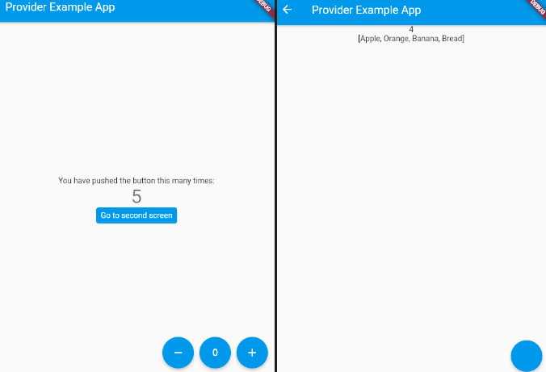

# TLDR



Make sure that `package:flutter/material.dart` and `package:provider/provider.dart`
are imported in the appropriate files.

Create a provider class in `lib/providers/counter_provider.dart`
```dart
class Counter with ChangeNotifier {
  int _count = 0;

  int get count => _count; // Getter
  void changeSomething() { // Setter function
    _count++;
    notifyListeners();
  }
}
```

Add the provider to a MultiProvider in `lib/main.dart`:
```dart
void main() {
  runApp(MultiProvider(
    providers: [
      ChangeNotifierProvider(create: (_) => Counter()),
    ],
    child: MyApp(),
  ));
}
```

use methods and watch state changes in any subcomponent using:
```dart
// Watch state (reloads entire widget on change)
Text('Count is: ${context.watch<Counter>().count}'),
// Set state
onPressed: () => context.read<Counter>().changeSomething(),
```
