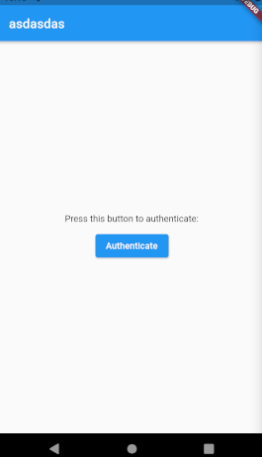
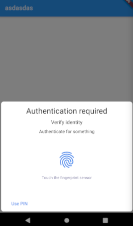
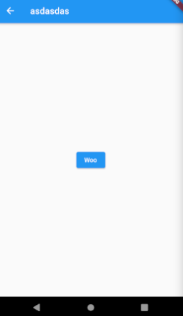

# authapp

See:
* [local_auth package docs](https://pub.dev/packages/local_auth)
* [Fingerprint with localAuth - Flutter Explained](https://www.youtube.com/watch?v=v155UMfPM6k) by Flutter Explained on YouTube

Contents:
- [authapp](#authapp)
  - [01. Install local_auth](#01-install-local_auth)
  - [02. Call](#02-call)
  - [03. Workaround errors](#03-workaround-errors)
    - [Not supported on web build](#not-supported-on-web-build)
    - [Android permissions setup](#android-permissions-setup)



Make sure that you have set-up your fingerprint in the mobile emulator.

## 01. Install local_auth

Install `local_auth` using pubspec assist or by changing `pubspec.yaml` +  `flutter get pub`

## 02. Call

```dart
import 'package:local_auth/local_auth.dart';
import 'package:flutter/foundation.dart' show kIsWeb;
//...
void authenticate(context) async {
  print('Authentication started...');

  // Check biometrics
  if (kIsWeb) return print('Cannot check biometrics on this device');
  bool canCheckBiometrics = await auth.canCheckBiometrics;
  if (!canCheckBiometrics) return print('Cannot check biometrics on this device');

  // Get available biometrics
  List<BiometricType> availableBiometrics = await auth.getAvailableBiometrics();
  print(availableBiometrics);

  // Authenticate
  bool authenticated = await auth.authenticate(localizedReason: 'Authenticate for something');
  print(authenticated);

  // Do stuff
  if (authenticated) {
    Navigator.pushNamed(context, '/dashboard');
  }
}
//...
onPressed: () => authenticate(context),
```

## 03. Workaround errors

### Not supported on web build

You will get an error if using on **Web**:
```
Uncaught (in promise) Error: MissingPluginException(No implementation
found for method getAvailableBiometrics on channel plugins.flutter.io/local_auth)
```

To avoid this you need to avoid it by checking the platform using:
```dart
// For web
import 'package:flutter/foundation.dart' show kIsWeb;
if (kIsWeb) return print('Cannot Authenticate on web');

// For other platforms
// import 'dart:io' show Platform;
// Platform.isMacOS; Platform.isWindows; Platform.isLinux;

// Or we can use Try Catch
import 'package:local_auth/error_codes.dart' as auth_error;
import 'package:flutter/services.dart';
try {
  bool didAuthenticate = await local_auth.authenticate(
      localizedReason: 'Please authenticate to show account balance');
} on PlatformException catch (e) {
  if (e.code == auth_error.notAvailable) {
    // Handle this exception here.
  }
}
```

### Android permissions setup

You will get an error if you are using **Android**:
```
PlatformException (PlatformException(no_fragment_activity,
local_auth plugin requires activity to be a FragmentActivity., null, null))
```

To avoid this you need to:
1. go to: `android/app/src/main/kotlin/com/example/authapp/MainActivity.kt`
```kotlin
import io.flutter.embedding.android.FlutterFragmentActivity
import io.flutter.embedding.engine.FlutterEngine
import io.flutter.plugins.GeneratedPluginRegistrant

class MainActivity: FlutterFragmentActivity() {
    override fun configureFlutterEngine(flutterEngine: FlutterEngine) {
        GeneratedPluginRegistrant.registerWith(flutterEngine)
    }
}
```
2. Then go to `android/app/src/debug/AndroidManifest.xml`, `android/app/src/profile/AndroidManifest.xml` and `android/app/src/main/AndroidManifest.xml`
3. Add the line `<uses-permission android:name="android.permission.USE_BIOMETRIC"/>` under `<manifest>` (note: USE_FINGERPRINT is depreciated)

If you still have problems, it is probably because you have not set your pin and fingerprint
in the settings.