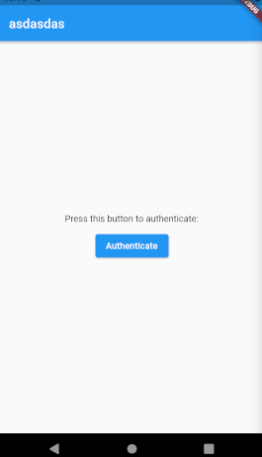

# TLDR



Create an authentication method:
```dart
import 'package:local_auth/local_auth.dart';
import 'package:flutter/foundation.dart' show kIsWeb;
//...
void authenticate(context) async {
  print('Authentication started...');

  // Check biometrics
  if (kIsWeb) return print('Cannot check biometrics on this device');
  bool canCheckBiometrics = await auth.canCheckBiometrics;
  if (!canCheckBiometrics) return print('Cannot check biometrics on this device');

  // Get available biometrics
  List<BiometricType> availableBiometrics = await auth.getAvailableBiometrics();
  print(availableBiometrics);

  // Authenticate
  bool authenticated = await auth.authenticate(localizedReason: 'Authenticate for something');
  print(authenticated);

  // Do stuff
  if (authenticated) {
    Navigator.pushNamed(context, '/dashboard');
  }
}
//...
onPressed: () => authenticate(context),
```

Android Setup for local authentication:
1. go to: `android/app/src/main/kotlin/com/example/authapp/MainActivity.kt`
```kotlin
import io.flutter.embedding.android.FlutterFragmentActivity
import io.flutter.embedding.engine.FlutterEngine
import io.flutter.plugins.GeneratedPluginRegistrant

class MainActivity: FlutterFragmentActivity() {
    override fun configureFlutterEngine(flutterEngine: FlutterEngine) {
        GeneratedPluginRegistrant.registerWith(flutterEngine)
    }
}
```
2. Then go to `android/app/src/debug/AndroidManifest.xml`, `android/app/src/profile/AndroidManifest.xml` and `android/app/src/main/AndroidManifest.xml`
3. Add the line `<uses-permission android:name="android.permission.USE_BIOMETRIC"/>` under `<manifest>` (note: USE_FINGERPRINT is depreciated)

If you still have problems, it is probably because you have not set your pin and fingerprint
in the settings.