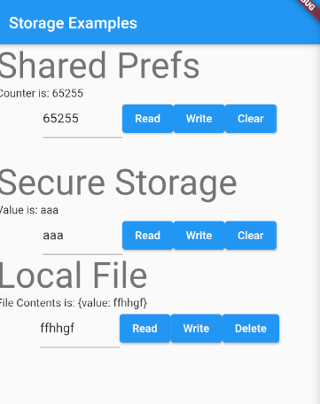

# Local Storage

See:
* [Flutter: The 4 Ways to Store Data Locally That You're Going to Need](https://levelup.gitconnected.com/the-4-ways-to-store-data-locally-in-your-flutter-app-that-youre-going-to-need-abdafa991ae3)
* [Flutter cookbook - key value persistence using prefs](https://flutter.dev/docs/cookbook/persistence/key-value)
* [Secure Storage Package](https://pub.dev/packages/flutter_secure_storage)

Ways to store data:
* Simple Key Value — Shared Preferences
* Sensitive Key Value — Secure Storage
* Highly Structured Tables — Hive / SQLite
* Large Temporary/Permanent Single Object — Local File Storage

Also:
* Google
* Dropbox
* iCloud
* OneDrive

Tip:
* Store data in encrypted file
* Store master password/key in secure storage



See 06_local_storage/storageapp/lib/screen.dart

## Shared Prefs

Install `shared_preferences` (https://pub.dev/packages/shared_preferences)

```dart
SharedPreferences prefs = await SharedPreferences.getInstance();

// Set a pref
await prefs.setInt('counter', counter);

// Get a pref
int counter = prefs.getInt('counter') ?? 0;
```

## Secure Storage

Secure key-value pairs. Stored in keychain or keychain (iOS), KeyStore (Android), libsecret (Linux).

Install `flutter_secure_storage` (https://pub.dev/packages/flutter_secure_storage)

Make sure that In `android/app/build.gradle` is set `minSdkVersion` to >= 18.

Does not work on Chrome.

```dart
final storage = new FlutterSecureStorage();

// Set a value
await storage.write(key: 'key', value: "Hello World!");

// Get a value
String readValue = await storage.read(key: 'key');
```

## Local File

Install `path_provider` (https://pub.dev/packages/path_provider)

See https://flutter.dev/docs/development/data-and-backend/json#consuming-json_serializable-models

```dart
final filename = "myfile";
final directory = (await getApplicationDocumentsDirectory()).path;
final file = File('$directory/$filename.json');

// Write a file
file.writeAsString(json.encode(user.toJson()));

// Get a file
User.fromJson(file.readAsString());
```