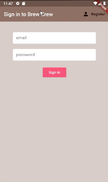
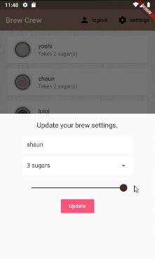

# brew_crew

A Firebase App which can be used to sign-in and select coffee preferences.

## Setup

We can go to https://console.firebase.google.com and create a
Firebase application.

We can add an iOS, Android, Web or Unity app.
* We can find the package name (company URL) in the flutter project files under `android/app/build.gradle`

1. Download `google-services.json` and move to `android/app/google-services.json`.

2. Copy Firebase SDK snippets and paste into `android/build.gradle`.

3. Copy Firebase SDK snippets and paste into `android/app/build.gradle`.

4. Install the [Firebase Auth](https://pub.dev/packages/firebase_auth) dart package.

5. Install the [Cloud Firestore](https://pub.dev/packages/cloud_firestore) dart package.

