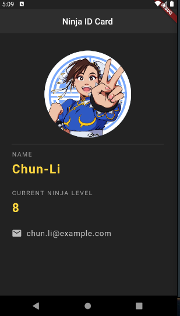

# Flutter Tutorial for Beginners

[Flutter Tutorial for Beginners](https://www.youtube.com/watch?v=1ukSR1GRtMU&list=PL4cUxeGkcC9jLYyp2Aoh6hcWuxFDX6PBJ) by The Net Ninja on YouTube.

- [Flutter Tutorial for Beginners](#flutter-tutorial-for-beginners)
  - [01. Basics](#01-basics)
    - [Widgets](#widgets)
    - [Simple app](#simple-app)
    - [Colors](#colors)
    - [Text Styles](#text-styles)
    - [Fonts](#fonts)
    - [Stateless Widgets & Hot Reload](#stateless-widgets--hot-reload)
    - [Images](#images)
    - [Buttons and Icons](#buttons-and-icons)
    - [Containers and Padding](#containers-and-padding)
    - [Rows and Columns](#rows-and-columns)
    - [Flutter Outline and Shortcuts](#flutter-outline-and-shortcuts)
    - [Expanded](#expanded)
  - [02. Ninja ID app](#02-ninja-id-app)
    - [Basic static content](#basic-static-content)
    - [Stateful Widgets](#stateful-widgets)
  - [03. Quotes](#03-quotes)
    - [Lists of data](#lists-of-data)
    - [Custom classes](#custom-classes)
    - [Cards](#cards)
    - [Passing functions to child widgets](#passing-functions-to-child-widgets)
  - [04. World Clock App](#04-world-clock-app)

vscode setup (see [here](https://www.youtube.com/watch?v=VHhksMa2Ffg)):
* Settings: `Dart: Preview Flutter Ui Guides`
* Ext: `Pubspec Assist` (use prompt to obtain dependencies/packages)
* Ext: `Awesome Flutter Snippets`
* Ext: `bloc`
* Ext: `Advanced New File` (ctrl+alt+n to create new folder/file)
* To make guides continuous: `editor.lineHeight: 17` (instead of 0)
* To remove indentation guides: `"[dart]": {"editor.renderIndentGuides": false,},`

## 01. Basics

### Widgets

There are many widgets and each widget can be configured using properties.

e.g:
* Text Widget
  * style
  * textAlign
  * overflow
  * maxLines
  * ...etc
* Button Widget
  * color
  * elevation
  * disabledColor
  * enabled
  * ...etc
* Row Widget
* Column Widget
* Image Widget

### Simple app

```dart
void main() => runApp(MaterialApp(
      home: Scaffold(
        appBar: AppBar(
          title: Text('my first app'),
          centerTitle: true,
        ),
        body: Center(
          child: Text('Hello ninjas!'),
        ),
        floatingActionButton: FloatingActionButton(
          child: Text('click'),
        ),
      ),
    ));
```

### Colors

We can add colors using the `Colors` object:
```dart
Colors.red[600]
```
We can also set strengths for the colors using the square brackets.

### Text Styles

We style text using `TextStyle` object
```dart
child: Text(
  'Hello ninjas!!!',
  style: TextStyle(fontSize: 20, fontWeight: FontWeight.bold),
),
```

### Fonts

If we want to add a custom font (not in library) we can downlaod a font from
[Google Fonts](https://fonts.google.com/), and save to the project (i.e. fonts
directory).

We can then add it to the pubspec.yaml file. Then use `fontFamily: 'My Font',`.

### Stateless Widgets & Hot Reload

We need to create a stateless widget widget with a `build` function in order to
use Hot-Reloading (not just a MaterialApp widget).

```dart
void main() => runApp(MaterialApp(home: Home()));

class Home extends StatelessWidget {
  @override
  Widget build(BuildContext context) {
    return Scaffold(
      appBar: AppBar(
        title: Text('my first app'),
        centerTitle: true,
        backgroundColor: Colors.red[600],
      ),
      body: Center(
        child: AssetImage('assets/space.png'),
      ),
      floatingActionButton: FloatingActionButton(
        onPressed: () {},
        child: Text('click'),
        backgroundColor: Colors.red,
      ),
    );
  }
}
```

### Images

We can use either `NetworkImages('URL')` or
`AssetImage(assets/image.png)`.

If using assets, you need to add assets to the pubspec.yaml file.

```dart
child: Image(image: NetworkImage('https://www.publicdomainpictures.net/pictures/40000/velka/spatiul-cosmic.jpg')),
child: Image(image: AssetImage('assets/space.png')),

// Shortcuts
Image.network('https://www.publicdomainpictures.net/pictures/40000/velka/spatiul-cosmic.jpg')
Image.asset('assets/space.png')
```

### Buttons and Icons

```dart
Icon(
  Icons.airport_shuttle,
  color: Colors.lightBlue,
  size: 50,
)

// Button with shadow
RaisedButton(
  onPressed: () {
    print('you clicked me!');
  },
  child: Text('Click Me!'),
  color: Colors.lightBlue,
),

// Button without shadow
FlatButton(
  onPressed: () {
    print('you clicked me!');
  },
  child: Text('Click Me!'),
  color: Colors.lightBlue,
),

// Button with icon
RaisedButton.icon(
  onPressed: () {
    print('you clicked me!');
  },
  icon: Icon(Icons.mail),
  label: Text('Click Me!'),
  color: Colors.amber,
),

// Icon that is a button
IconButton(
  onPressed: () {
    print('you clicked me!');
  },
  icon: Icon(Icons.mail),
  color: Colors.amber,
),
```

### Containers and Padding

**Containers**:
* Fills maxmimum area when contains no children.
* Fills minimum area when contains children.
* We can add padding using `padding: EdgeInsets.all(20)` (can customize)
* We can also add margin `margin: EdgeInsets.all(2)` (can customize)

If we only want padding, we can use the `Padding` class.

### Rows and Columns

```dart
Row(
  mainAxisAlignment: MainAxisAlignment.spaceEvenly, // Horizontal space
  crossAxisAlignment: CrossAxisAlignment.end, // Vertical alignment in row
  children: <Widget>[
    // ...
  ],
)
Column(
  mainAxisAlignment: MainAxisAlignment.spaceEvenly, // Horizontal space
  crossAxisAlignment: CrossAxisAlignment.end, // Vertical alignment in row
  children: <Widget>[
    // ...
  ],
)
```
Columns and rows are basically the same except the main and cross axis
directions are swapped.

Columns are probably most useful for most apps.

We can also use nested rows/columns. Note: that columns/rows will fill maximium
distance.


### Flutter Outline and Shortcuts

If you click on a class, a light-bulb will pop up which provides quick-actions.


### Expanded

The `Expanded` widget will expand itself so that space is filled in a
row/column.

This can be used to devide space into portions of specific size.


.png)

We can also have multiple `Expanded` widgets in one `Row` and use the flex
property to maintain a size ratio between each (like flexbox).

We can also use Expanded to scale `Images` in accordance to their available
space/flex ratio.

## 02. Ninja ID app

We will make a material theme app with some customizations.

### Basic static content

**SizedBox** for padding - The `SizedBox` widget is an alternate easy way to add padding around a widget.
It is simply a invisible box which fills space.

For the email, we just used a `Row` containing an `Icon`, `SizedBox`, and
`Text`.

A button icon might also be good for this, i.e:
```dart
RaisedButton.icon(
  onPressed: () => {},
  icon: Icon(Icons.email,color: Colors.amberAccent[200]),
  color: Colors.transparent,
  label: Text('chun.li@example.com',
    style: TextStyle(color: Colors.amberAccent[200])),
)
```

**CircleAvatar** for profile icon. This was placed inside of a `Center` widget.

**Divider** for section divider



### Stateful Widgets

Stateful widgets have a widget class, and a state class.

```dart
// Widget
class Test extends StatefulWidget {
  @override
  _TestState createState() => _TestState();
}

// State object (updates the widget tree on state change)
class _TestState extends State<Test> {
  int counter = 1;

  @override
  Widget build(BuildContext context) {
    return Container();
  }
}
```

We can convert NinjaCard to a stateful widget by using the light bulb shortcut.

In order to change the state (change ninja level), we need to use the setState
function. Otherwise it will not reload the widget tree.

```dart
onPressed: () {
  setState(() {
    ninjaLevel += 1;
  });
},
```


## 03. Quotes

### Lists of data

We can choose to either use:
* The inbuilt `ListView` component
* The map function

We can use the map function (returns an Iterable) and cast to a list.
```dart
children: quotes.map((q) => Text(q)).toList(),
```
(Note: Arrow function is same as Anon function except returns the
result and does not need braces)

### Custom classes

We can create classes to store our data.
```dart
class Quote {
  String text;
  String author;

  Quote({this.text, this.author});
}
```
We can also use `Quote({String text, String author}){...}` to force
parameters to be named parameters.

We can also use `Quote({this.text, this.author});` to perform
immediate assignment to the class.

(`children: quotes.map((q) => Text('${q.text} - ${q.author}')).toList()`)

### Cards

We will use a helper function to create cards.
```dart
Widget quoteTemplate(quote) {
  return Card(
    margin: EdgeInsets.fromLTRB(16, 16, 16, 0),
    child: Padding(
      padding: const EdgeInsets.all(12),
      child: Column(
        crossAxisAlignment: CrossAxisAlignment.stretch,
        children: <Widget>[
          Text(
            quote.text,
            style: TextStyle(fontSize: 18, color: Colors.grey[600]),
          ),
          SizedBox(height: 6),
          Text(
            quote.author,
            style: TextStyle(fontSize: 14, color: Colors.grey[800]),
          ),
          SizedBox(height: 6),
        ],
      ),
    ),
  );
}
```
* The `Card`-`margin` property adds padding around the whole body.
* The `Padding` adds padding around the text elements inside each card.
* The `Column`-`crossAxisAlignment` property can be used to stretch the `Text`
widget to max-width.

We can extract this into a stateless class for modularisation.
```dart
class QuoteCard extends StatelessWidget {
  final Quote quote;
  QuoteCard({this.quote});

  @override
  Widget build(BuildContext context) {
    return Card(
      margin: EdgeInsets.fromLTRB(16, 16, 16, 0),
      child: Padding(
        padding: const EdgeInsets.all(12),
        child: Column(
          crossAxisAlignment: CrossAxisAlignment.stretch,
          children: <Widget>[
            Text(
              quote.text,
              style: TextStyle(fontSize: 18, color: Colors.grey[600]),
            ),
            SizedBox(height: 6),
            Text(
              quote.author,
              style: TextStyle(fontSize: 14, color: Colors.grey[800]),
            ),
            SizedBox(height: 6),
          ],
        ),
      ),
    );
  }
}
```
* Stateless widgets cannot contain data/attributes unless the `final` keyword
is used to denote that they cannot be changed.

### Passing functions to child widgets

We will add a delete button on the `QuoteCard` widget. The problem is that the
state is stored in the parent widget (`QuoteList`).

We must pass the function to delete a quote into child widgets.
```dart
Column(
  children: quotes
    .map(
      (q) => QuoteCard(
        quote: q,
        delete: () {
          setState(() => quotes.remove(q));
        },
      ),
    )
    .toList(),
),
```

And store the function in the child widget:
```dart
final Quote quote;
final Function delete;
QuoteCard({this.quote, this.delete});
```

## 04. World Clock App

We will have pages:
* Loading
* Home
* ChooseLocation

We can import using either: `import 'pages/home.dart';` or
`import 'package:world_time/pages/home.dart';`.
