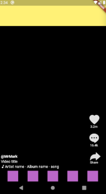

# Tiktok clone

Following tutorials

Building TikTok's UI in Flutter - By Dane Mackier
* https://www.youtube.com/watch?v=kJ2mGh5BLYk
* https://www.filledstacks.com/post/building-tik-tok-s-ui-in-flutter-the-building-process/
* https://github.com/FilledStacks/flutter-tutorials/tree/master/001-tik_tok_ui


## Steps

### 01. Layout


First we will layout the sections.


```dart
import 'package:flutter/material.dart';

class Home extends StatefulWidget {
  @override
  _HomeState createState() => _HomeState();
}

class _HomeState extends State<Home> {
  @override
  Widget build(BuildContext context) {
    return Scaffold(
      body: Column(
        children: <Widget>[
          // Top Section (bar)
          Container(
            height: 100,
            color: Colors.yellow[300],
          ),

          // Middle Section (desc + btns) [expanded vertically]
          Expanded(
            // Row splits middle into two parts
            child: Row(
              children: <Widget>[
                // Desc section [expanded horizontally]
                Expanded(child: Container(color: Colors.green[300])),
                // Btns section [fixed-size space on the right]
                Container(
                  width: 100,
                  color: Colors.red[300],
                )
              ],
            ),
          ),

          // Bottom Section (bar)
          Container(
            height: 100,
            color: Colors.blue[300],
          ),
        ],
      ),
    );
  }
}
```

### 02. Section widgets

We will seperate each section into getter properties for code
clarity/modularity.
* topSection
* middleSection
  * videoDescription
  * actionsToolbar
* bottomSection
```dart
import 'package:flutter/material.dart';

class Home extends StatefulWidget {
  @override
  _HomeState createState() => _HomeState();
}

class _HomeState extends State<Home> {
  Widget get topSection => Container(
        height: 100,
        color: Colors.yellow[300],
      );

  Widget get middleSection => Expanded(
        // Row splits middle into two parts
        child: Row(
          children: <Widget>[
            videoDescription, // Video description [expands horizontally]
            actionsToolbar, // Actions toolbar [fixed-size space on the right]
          ],
        ),
      );

  Widget get videoDescription => Expanded(
        child: Container(color: Colors.green[300]),
      );

  Widget get actionsToolbar => Container(
        width: 100,
        color: Colors.red[300],
      );

  Widget get bottomSection => Container(
        height: 100,
        color: Colors.blue[300],
      );

  @override
  Widget build(BuildContext context) {
    return Scaffold(
      body: Column(
        children: <Widget>[
          topSection, // Top Section (bar)
          middleSection, // Middle Section (desc + btns) [expands vertically]
          bottomSection, // Bottom Section (bar)
        ],
      ),
    );
  }
}
```

### 03. Video Description layout

The video description will comprise of a number of rows which fills upwards
from the bottom of the middle section.

```dart
  Widget get middleSection => Expanded(
        // Row splits middle into two parts (left/right)
        child: Row(
          mainAxisSize: MainAxisSize.max, // ??? don't know what this does
          crossAxisAlignment: CrossAxisAlignment.end, // Move to bottom (fillup)
          children: <Widget>[
            videoDescription, // Video description [expands horizontally]
            actionsToolbar, // Actions toolbar [fixed-size space on the right]
          ],
        ),
      );

  Widget get videoDescription => Expanded(
        child: Column(
          mainAxisSize: MainAxisSize.min, // Only take up space of children (so it fills from bottom only to the required space)
          children: <Widget>[
            Container(
                height: 10,
                color: Colors.green[300],
                margin: EdgeInsets.only(top: 10)),
            Container(
                height: 10,
                color: Colors.green[300],
                margin: EdgeInsets.only(top: 10)),
            Container(
                height: 10,
                color: Colors.green[300],
                margin: EdgeInsets.only(top: 10)),
          ],
        ),
      );
```

### 04. Actions Toolbar layout

The actions toolbar will have a bunch of buttons. The buttons will fill minimum
space so that it does not fill from top to bottom and expands upwards.


```dart
  Widget get actionsToolbar => Container(
        width: 100,
        color: Colors.red[300],
        child: Column(
          mainAxisSize: MainAxisSize.min, // Use minimum size so it takes minimum space and expands upwards when more buttons exists
          children: List<Widget>.generate(
            5,
            (_) => Container(
              width: 60,
              height: 60,
              color: Colors.blue[300],
              margin: EdgeInsets.only(top: 20),
            ),
          ),
        ),
      );
```

### 05. Bottom Section bar

We will set the bottom section as evenly spaced container widgets horizontally.


```dart
  Widget get bottomSection => Row(
        mainAxisAlignment: MainAxisAlignment.spaceEvenly,
        children: List<Widget>.generate(
          5,
          (index) => Container(
            width: 40,
            height: 40,
            color: Colors.purple[300],
          ),
        ),
      );
```

### 06. Modularise into files

We will move widgets into their own files:
* actions_toolbar
* bottom_toolbar
* video_description

it is a good idea to only modularise widgets if they have reletively small
formatting (like always at bottom, size filled, etc).

### 07. Video Description content

We will add the user, video title and artist-album descriptions.

We will:
* Wrap the row with a container
  * Add `height` to give exact height size (instead of relying on size of children)
  * Add `padding` to space confortably around the text
*  Use the column with `mainAxisAlignment` to space the text evenly in the container.


```dart
class VideoDescription extends StatelessWidget {
  @override
  Widget build(BuildContext context) {
    return Expanded(
      child: Container(
        height: 70,
        padding: EdgeInsets.symmetric(horizontal: 10, vertical: 5),
        child: Column(
            mainAxisAlignment: MainAxisAlignment.spaceEvenly, // Space evenly
            crossAxisAlignment: CrossAxisAlignment.start, // Align left
            children: <Widget>[
              Text('@MrMark', style: TextStyle(fontWeight: FontWeight.bold)),
              Text('Video title'),
              Row(
                children: <Widget>[
                  Icon(Icons.music_note, size: 15),
                  Text('Artist name - Album name - song')
                ],
              ),
            ]),
      ),
    );
  }
}
```

### 08. Actions Toolbar content

We will update the buttons for the actions toolbar.

We will add the icons to the assets/fonts folder, update the pubspec.yaml, and
create a social action button function-widget.


```dart
import 'package:flutter/material.dart';

import 'package:tiktokclone/tiktok_icons.dart';

class ActionsToolbar extends StatelessWidget {
  @override
  Widget build(BuildContext context) {
    return Container(
      width: 100,
      color: Colors.red[300],
      child: Column(
          mainAxisSize: MainAxisSize.min, // Use min space and expand upwards
          children: <Widget>[
            _getSocialAction(title: '3.2m', icon: TikTokIcons.heart),
            _getSocialAction(title: '16.4k', icon: TikTokIcons.chat_bubble),
            _getSocialAction(
                title: 'Share', icon: TikTokIcons.reply, iconSize: 30),
          ]),
    );
  }
}

Widget _getSocialAction({String title, IconData icon, double iconSize = 35}) {
  return Container(
    width: 60,
    height: 60,
    color: Colors.blue[300],
    margin: EdgeInsets.only(top: 20),
    child: Column(children: <Widget>[
      Icon(icon, size: iconSize, color: Colors.grey[300]),
      Padding(
        padding: EdgeInsets.only(top: 2),
        child: Text(title, style: TextStyle(fontSize: 12)),
      ),
    ]),
  );
}
```

### 09. Update Themes

We will:
1. Set default text colour to white
2. Set the music note icon to white
3. Set the background colour of the scaffold to black
4. Remove background colours on containers



